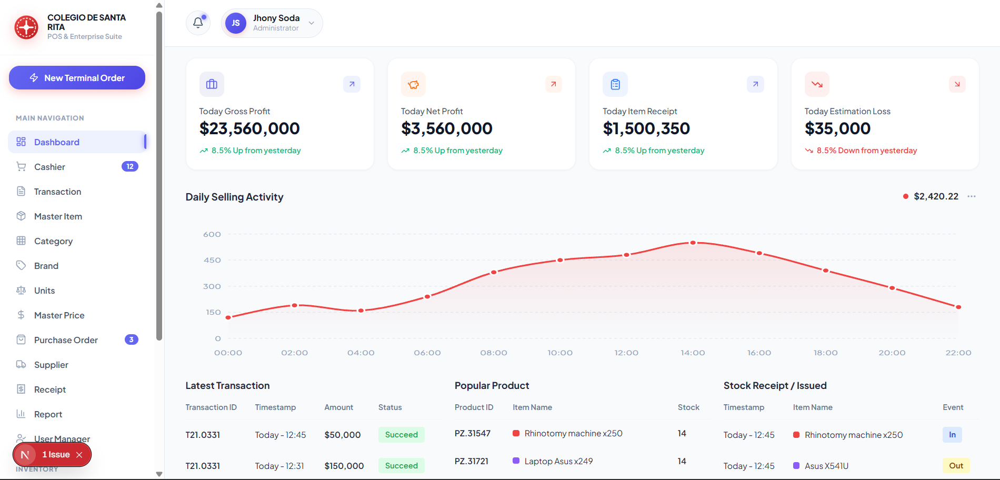

<div align="center">

# 🛒 Web Slicing — POS Dashboard

**A modern Point of Sale dashboard built with React & Next.js**


</div>

---

## ✨ Features

- 📊 **Daily Selling Activity** — Interactive SVG line chart with smooth spline curves and hover tooltips
- 💳 **Latest Transactions** — Real-time transaction feed with status badges
- 📦 **Popular Products** — Top-selling items with stock indicators
- 🔄 **Stock Receipt / Issued** — Inventory movement log with In/Out event tracking
- 🗂️ **Sidebar Navigation** — Full POS menu with 13+ navigation items
- 🔔 **Notification Center** — Bell dropdown with live alert feed
- 👤 **User Profile** — Admin profile pill in the header

---

## 🖼️ Preview

| Dashboard Overview |
|---|
|  |

---

## 🗂️ Project Structure

```
src/
├── components/
│   ├── Sidebar.jsx            # Left navigation sidebar
│   ├── Header.jsx             # Top header bar
│   ├── StatCards.jsx          # 4 KPI summary cards
│   ├── DailySellingChart.jsx  # SVG line chart
│   ├── LatestTransactions.jsx # Transaction table
│   ├── PopularProducts.jsx    # Popular products table
│   └── StockReceiptIssued.jsx # Stock movement table
├── App.js                     # Root layout
└── index.css                  # Global CSS variables & base styles
```

---

## 🚀 Getting Started

### Prerequisites

- Node.js `>= 18`
- npm or yarn

### Installation

```bash
# Clone the repository
git clone https://github.com/priambodogigieh-afk/web-slicing.git

# Navigate to the project
cd web-slicing

# Install dependencies
npm install
```

### Running the App

```bash
# Development server
npm run dev
```

Open [http://localhost:3000](http://localhost:3000) in your browser.

### Build for Production

```bash
npm run build
npm start
```

---

## 🛠️ Tech Stack

| Technology | Version | Purpose |
|---|---|---|
| [React](https://react.dev) | 19 | UI Framework |
| [Next.js](https://nextjs.org) | 15 | App Framework |
| [Lucide React](https://lucide.dev) | 0.475 | Icon Library |
| CSS Custom Properties | — | Theming & Design Tokens |
| SVG | — | Custom Charts |

---

## 🎨 Design System

The project uses a custom CSS variable system for consistent theming:

```css
--bg-app: #f2f5fa;       /* App background */
--color-primary: #ef4444; /* Brand red */
--text-primary: #1e293b;  /* Main text */
--radius-md: 12px;        /* Card border radius */
```

---

<div align="center">

Made with ❤️ by [priambodogigieh-afk](https://github.com/priambodogigieh-afk)

</div>
